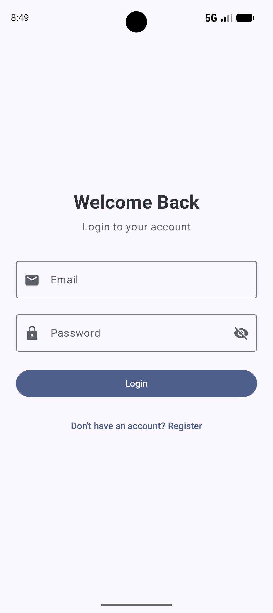
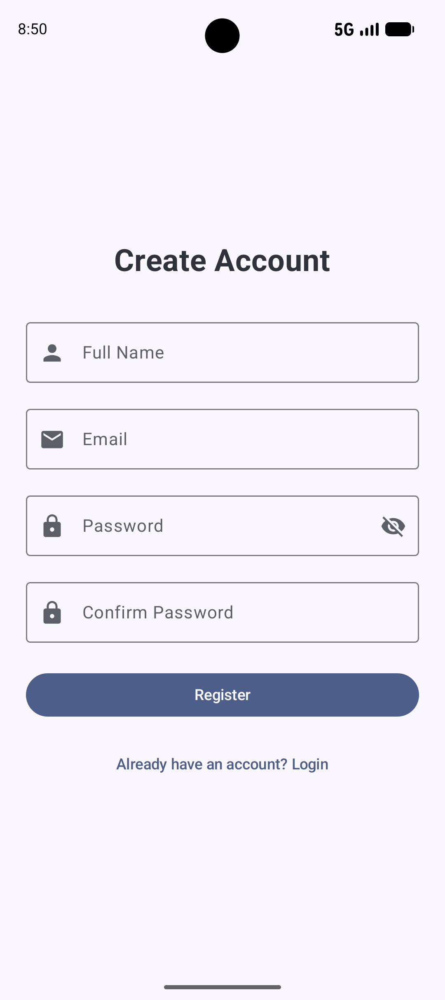
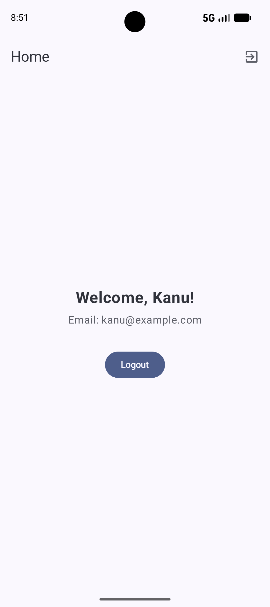

# AuthApp - Production-Ready Android Authentication

[](https://kotlinlang.org)
[](https://developer.android.com/jetpack/compose)
[](https://dagger.dev/hilt/)

AuthApp is a robust, production-ready Android application demonstrating a complete authentication flow. Built with **Clean Architecture**, **MVVM**, and the latest **Jetpack Compose** (Material 3), it serves as a blueprint for modern Android development.

---

## 📸 Screenshots

| Login | Register | Home |
|:---:|:---:|:---:|
|  |  |  |

---

## 🚀 Features

- **Dynamic Splash Screen**: Automatically routes users based on their authentication state (Token existence check).
- **Advanced Login**:
    - Real-time form validation.
    - Password visibility toggle.
    - Loading states & Error handling with Snackbars.
- **Secure Registration**:
    - Multi-field validation (Name, Email, Password, Confirmation).
    - Strong password enforcement logic.
- **Home Dashboard**: Displays authenticated user profile data.
- **Session Management**: Persistent login via DataStore (JWT) and local caching with Room.
- **Animated Navigation**: Smooth transitions between screens using Compose Navigation.

---

## 🏗️ Architecture & Design Patterns

The project follows the **Official Android Architecture Recommendations** and **Clean Architecture** principles.

### Folder Structure
```text
com.kanu.loginregister
│
├── data
│   ├── local           # Room Database, DAOs, DataStore (TokenManager)
│   ├── remote          # Retrofit API, DTOs, Mock Interceptors
│   └── repository      # Repository Implementations (SSOT Pattern)
│
├── domain
│   ├── model           # Plain Kotlin POJOs
│   ├── repository      # Domain Repository Interfaces
│   └── usecase         # Business Logic (Single Responsibility)
│
├── presentation
│   ├── login           # UI, ViewModel, State for Login
│   ├── register        # UI, ViewModel, State for Register
│   ├── home            # UI dashboard
│   ├── splash          # Initial routing logic
│   └── components      # Reusable UI widgets
│
├── di                  # Hilt Modules
├── navigation          # Compose Navigation setup
└── ui.theme            # Material 3 Theming
```

### Key Principles
- **SSOT (Single Source of Truth)**: Data flows from the Repository, fetching from Remote and caching in Local.
- **UDF (Unidirectional Data Flow)**: ViewModels expose UI State; UI sends Events back.
- **Separation of Concerns**: Business logic is isolated in UseCases, keeping ViewModels lean.
- **Dependency Injection**: Hilt handles the lifecycle and injection of all core components.

---

## 🛠️ Tech Stack

- **UI**: Jetpack Compose (Material 3)
- **DI**: Hilt
- **Network**: Retrofit + OkHttp + GSON
- **Database**: Room (Local Caching)
- **Preferences**: Jetpack DataStore (JWT Storage)
- **Concurrency**: Kotlin Coroutines & Flow
- **Navigation**: Navigation Compose
- **Testing**: JUnit 4, Mockito-Kotlin

---

## 🛠️ Development Setup

1. **Clone the project**:
   ```bash
   git clone https://github.com/kanu5858/Android-Auth-App.git
   ```
2. **Open in Android Studio**: (Ladybug or later recommended).
3. **Sync Gradle**: Let the project download all dependencies.
4. **Run**: Select the `app` configuration and hit the Play button.

> **Note**: This app uses a `MockInterceptor`. You don't need a live backend to test the login/register flows. Any valid-looking email/password will work for demonstration.

---

## 🧪 Testing

The app includes unit tests for the core logic:
- `LoginViewModelTest`: Validates state changes and navigation events during login.
- `RegisterViewModelTest`: Ensures form validation logic works as expected.

Run tests via:
```bash
./gradlew test
```

---

## 📄 License
This project is licensed under the MIT License.
